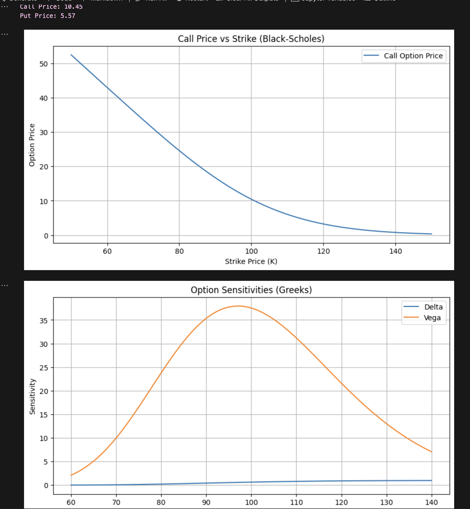

# European Option Pricing with Black-Scholes

This project implements the Black-Scholes model to price European call and put options and analyze sensitivity using the Greeks (Delta, Gamma, Vega).

## Features
- Price European call and put options
- Visualize how price changes with strike price
- Analyze Delta and Vega as a function of stock price

## How to Run

1. Clone repo and create virtual environment:

2. Install dependencies:

3. Run notebook:

## 📁 Project Structure
european-option-pricing/
├── .venv/                     # Python virtual environment
├── notebooks/                 # Jupyter notebooks
│   └── black_scholes_pricing.ipynb
├── outputs/                   # Plots and generated output
│   └── surfaces/              # Sensitivity plots, price graphs
├── test_imports.py           # Simple file to test imports
├── utils/                    # Custom pricing and Greeks code
│   └── bs_functions.py
├── requirements.txt          # Python packages list
└── README.md                 # Project documentation

## 📈 Sample Output

## 👤 Author

Amanda Achiangia  
BSc Applied Mathematics (Financial Mathematics), York University  
Aspiring Quantitative Finance Professional  
[LinkedIn](https://www.linkedin.com/in/amanda-a-602328284/) | [GitHub](https://github.com/sensor-aae)
