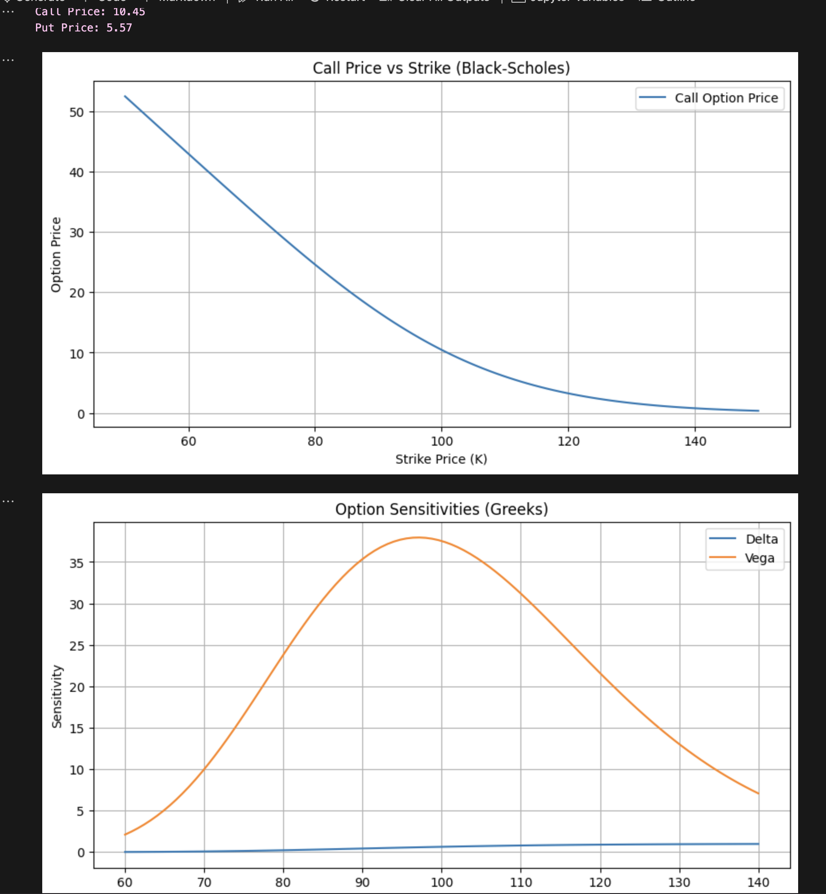

# European Option Pricing with Black-Scholes

This project implements the Black-Scholes model to price European call and put options and analyze sensitivity using the Greeks (Delta, Gamma, Vega).

## Features

- Price European call and put options
- Visualize how price changes with strike price
- Analyze Delta and Vega as a function of stock price

## How to Run

1. **Clone the repo and navigate into it:**
   ```bash
   git clone https://github.com/sensor-aae/European-Option-Pricing.git
   cd European-Option-Pricing
   ```

2. **Create a virtual environment and activate it:**
   ```bash
   python3 -m venv .venv
   source .venv/bin/activate
   ```

3. **Install dependencies:**
   ```bash
   pip install -r requirements.txt
   ```

4. **Run the notebook:**
   ```bash
   jupyter notebook notebooks/black_scholes_pricing.ipynb
   ```

## 📁 Project Structure

```
european-option-pricing/
├── .venv/                  # Python virtual environment
├── notebooks/              # Jupyter notebooks
│   └── black_scholes_pricing.ipynb
├── outputs/                # Plots and generated output
│   └── surfaces.png        # Sensitivity plots, price graphs
├── utils/                  # Custom pricing and Greeks code
│   └── bs_functions.py
├── requirements.txt        # Python packages list
├── README.md               # Project documentation
```

## 📈 Sample Output



## Interpretation

The Option Greeks plot above illustrates how option sensitivities vary with strike price for a call option.

- **Delta** — the rate of change of the option price with respect to the underlying stock price — is high when the call option is deep in the money and decreases as the strike price increases.
- **Vega** — the sensitivity of the option price to changes in volatility — peaks when the option is at the money and diminishes for deep in- or out-of-the-money options.

These sensitivities help traders understand how option values respond to movements in the underlying asset price and volatility.

## 👤 Author

Amanda Achiangia  
BSc Applied Mathematics (Financial Mathematics), York University  
Aspiring Quantitative Finance Professional  
[LinkedIn](https://www.linkedin.com/in/amanda-a-6023282804/) | [GitHub](https://github.com/sensor-aae)
